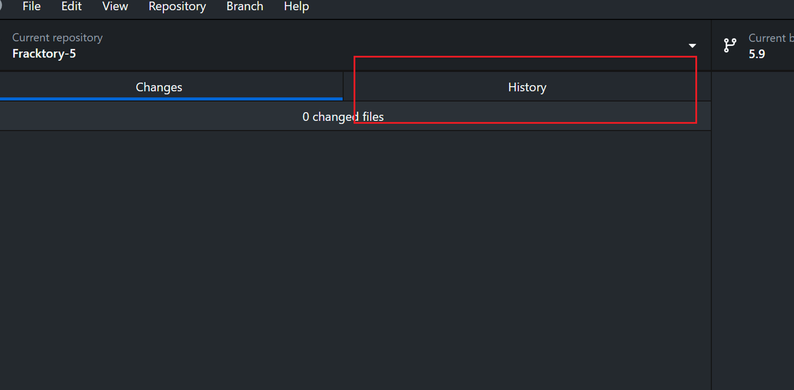

# Fracktory
based on Ultimaker Cura

**Contribute Printer Profiles?** -- Please [look here](https://github.com/Ultimaker/Cura/wiki/Adding-new-machine-profiles-to-Cura) first. <br>
**Contribute Translations?** -- Please [look here](https://github.com/Ultimaker/Cura/wiki/Translating-Cura) first.

<br>

[![Button Building]][Building]   
[![Button Plugins]][Plugins]   
[![Button Machines]][Machines]

[![Button Report]][Report]   
[![Button Settings]][Settings]   
[![Button Localize]][Localize]

<br>
<br>

</div>

<br>

[](https://api.securityscorecards.dev/projects/github.com/Ultimaker/Cura)

<br>

<!----------------------------------------------------------------------------->

[Contributors]: https://github.com/Ultimaker/Cura/graphs/contributors
[PullRequests]: https://github.com/Ultimaker/Cura/pulls
[Machines]: https://github.com/Ultimaker/Cura/wiki/Adding-new-machine-profiles-to-Cura
[Building]: https://github.com/Ultimaker/Cura/wiki/Getting-Started
[Localize]: https://github.com/Ultimaker/Cura/wiki/Translating-Cura
[Settings]: https://github.com/Ultimaker/Cura/wiki/Profiles-&-Settings
[Plugins]: https://github.com/Ultimaker/Cura/wiki/Plugins-And-Packages
[Closed]: https://github.com/Ultimaker/Cura/issues?q=is%3Aissue+is%3Aclosed
[Issues]: https://github.com/Ultimaker/Cura/issues
[Conan]: https://github.com/Ultimaker/Cura/actions/workflows/conan-package.yml
[Test]: https://github.com/Ultimaker/Cura/actions/workflows/unit-test.yml
[Downloads]: https://github.com/Ultimaker/Cura/releases/latest

[License]: LICENSE
[Report]: docs/Report.md
[Logo]: resources/images/cura-icon.png
[#]: #


<!---------------------------------[ Badges ]---------------------------------->

[Badge Contributors]: https://img.shields.io/github/contributors/ultimaker/cura?style=for-the-badge&logoColor=white&labelColor=db5e8a&color=ab4a6c&logo=GitHub
[Badge PullRequests]: https://img.shields.io/github/issues-pr/ultimaker/cura?style=for-the-badge&logoColor=white&labelColor=bb9f3e&color=937d31&logo=GitExtensions
[Badge License]: https://img.shields.io/badge/License-LGPL3-336887.svg?style=for-the-badge&labelColor=458cb5&logoColor=white&logo=GNU
[Badge Closed]: https://img.shields.io/github/issues-closed/ultimaker/cura?style=for-the-badge&logoColor=white&labelColor=629944&color=446a30&logo=AddThis
[Badge Issues]: https://img.shields.io/github/issues/ultimaker/cura?style=for-the-badge&logoColor=white&labelColor=c34360&color=933349&logo=AdBlock
[Badge Conan]: https://img.shields.io/github/actions/workflow/status/Ultimaker/Cura/conan-package.yml?branch=main&style=for-the-badge&logoColor=white&labelColor=6185aa&color=4c6987&logo=Conan&label=Conan%20Package
[Badge Test]: https://img.shields.io/github/actions/workflow/status/Ultimaker/Cura/unit-test.yml?branch=main&style=for-the-badge&logoColor=white&labelColor=4a999d&color=346c6e&logo=Codacy&label=Unit%20Test
[Badge Size]: https://img.shields.io/github/repo-size/ultimaker/cura?style=for-the-badge&logoColor=white&labelColor=715a97&color=584674&logo=GoogleAnalytics
[Badge Downloads]: https://img.shields.io/github/downloads-pre/Ultimaker/Cura/latest/total?style=for-the-badge


<!---------------------------------[ Buttons ]--------------------------------->

[Button Localize]: https://img.shields.io/badge/Help_Localize-e2467d?style=for-the-badge&logoColor=white&logo=GoogleTranslate
[Button Machines]: https://img.shields.io/badge/Adding_Printers-yellow?style=for-the-badge&logoColor=white&logo=CloudFoundry
[Button Settings]: https://img.shields.io/badge/Configuration-00979D?style=for-the-badge&logoColor=white&logo=CodeReview
[Button Building]: https://img.shields.io/badge/Building_Cura-blue?style=for-the-badge&logoColor=white&logo=GitBook
[Button Plugins]: https://img.shields.io/badge/Plugin_Usage-569A31?style=for-the-badge&logoColor=white&logo=ROS
[Button Report]: https://img.shields.io/badge/Report_Issues-C9284D?style=for-the-badge&logoColor=white&logo=Cliqz


# Fracktory-Cura-Slicer-Development
Compiling Cura from Source using documentation 

## Installing Requirements
installing the requriemrts mentioned in https://github.com/Ultimaker/Cura/wiki/Getting-Started

Following programs need to be installed for running from source on Windows:

- Windows 10 or higher
- Visual Studio with MSVC 2022 or higher
- Python 3.12 or higher
- venv (Python)
- sip (Python) 6.5.1
- CMake 3.23 or higher
- Ninja 1.10 or higher
- Conan >=2.7.0 <3.0.0


#### IMPORTANT NOTE: Install there using Powershell. Use the native powershell, not x86 version
#### Check https://www.architectryan.com/2018/03/17/add-to-the-path-on-windows-10/ to know how to add programs to PATH


## Installation Steps

1. **Install Windows 10 or higher**: Ensure you are running Windows 10 or a later version.

2. **Install Visual Studio**:
   - Download and install Visual Studio 2022 or higher from [visualstudio.microsoft.com](https://visualstudio.microsoft.com/).
   - During installation, select the "Desktop development with C++" workload.
   - Ensure Visual Studio is added to the system PATH.

3. **Install Python**:
   - Download and install Python 3.12 or higher from [python.org](https://www.python.org/downloads/).
   - Ensure Python is added to the system PATH during installation.

4. **Install Python Packages**:
   - Install `sip` version 6.5.1:
     ```sh
     pip install sip==6.5.1
     ```
   5. **Install CMake**:
      - Download and install CMake 3.23 or higher from [cmake.org](https://cmake.org/download/). Make sure to select the appropriate installer for your system (e.g., Windows x64 Installer).
      - Ensure CMake is added to the system PATH during installation.

   6. **Install Ninja**:
      - Download Ninja 1.10 or higher from [ninja-build.org](https://github.com/ninja-build/ninja/releases).
      - Extract the downloaded zip file to a folder, for example, `C:\Ninja`.
      - Add the Ninja folder to the system PATH:
        1. Open the Start Menu, search for "Environment Variables", and select "Edit the system environment variables".
        2. In the System Properties window, click on the "Environment Variables" button.
        3. In the Environment Variables window, find the "Path" variable in the "System variables" section and select it. Click "Edit".
        4. In the Edit Environment Variable window, click "New" and add the path to the Ninja folder, e.g., `C:\Ninja`.
        5. Click "OK" to close all windows.


7. **Install Conan**:

For 5.9 and earlier:

   - Install Conan version >=2.7.0 <3.0.0:
     ```sh
     pip install "conan>=1.58.0,<2.0.0"
     ```

For 5.10 and later:

   - Install Conan version >=2.7.0 <3.0.0:
     ```sh
     pip install "conan>=2.7.0,<3.0.0"
     ```


Ensure all installed programs are available in the system PATH. You can verify this by running the following commands in a command prompt:
```sh
python --version
pip show sip
cmake --version
ninja --version
conan --version
```

If any program is not available in the PATH, follow these steps to add it:

1. Open the Start Menu, search for "Environment Variables", and select "Edit the system environment variables".
2. In the System Properties window, click on the "Environment Variables" button.
3. In the Environment Variables window, find the "Path" variable in the "System variables" section and select it. Click "Edit".
4. In the Edit Environment Variable window, click "New" and add the path to the directory where the program is installed. For example:
   - For Python: `C:\Python39`
   - For CMake: `C:\Program Files\CMake\bin`
   - For Ninja: `C:\Program Files\Ninja`
5. Click "OK" to close all windows.
6. It may need you to restart the machine after a new installation for the program to show up in your PATH


## Installation/Compilation

remove older packages with 
`conan remove "*" -s -b -f`
. delete .conan folders in Uers and C:/ or D:/

1. In case you are using custom Cura Engine (Refer https://github.com/Ultimaker/CuraEngine/issues/2195 to fix conan error):
   - Install Cura Engine with the following steps:
      ```sh
      conan config install https://github.com/FracktalWorks/conan-config.git
      conan profile new default --detect --force
      git clone https://github.com/FracktalWorks/CuraEngine.git
      cd CuraEngine
      conan create . curaengine/5.9.1@FracktalWorks/stable --build=missing --update
      ```

2. Install Fracktory ("Refer https://github.com/Ultimaker/CuraEngine/issues/2195 to fix conan error):
   ```
   conan config install https://github.com/FracktalWorks/conan-config.git
   conan profile detect --force
   https://github.com/FracktalWorks/Fracktory-5.git
   cd Fracktory-5
   # If using custom Curaengine:
   conan install . --build=missing --update --require-override=curaengine/5.9.1@FracktalWorks/stable -o cura:devtools=True -g VirtualPythonEnv
   # If using Curaengine from Ultimaker source:
   conan install . --build=missing --update -o cura:devtools=True -g VirtualPythonEnv
   ```
## Activate and run

1. set environment part to python installed in the builds virtual environment:
   `$env:PYTHONPATH = 'C:\Users\Vijay\Documents\GitHub\Fracktory-5\venv\Scripts'`
2. Activate virtual environment:
   `.\venv\Scripts\activate.ps1`
3. Run:
   `python cura_app.py`


   ## Settings latest verion for update checks:

   change values in `latest.json` file in `Fracktory-5` folder in the following format to have cura check for latest version available

   ```
   {
    "cura": {
        "Windows": {
            "major": 5,
            "minor": 6,
            "revision": 0,
            "url": "https://github.com/FracktalWorks/Fracktory-5/releases"
        }
    },
    "cura-beta": {
        "Windows": {
            "major": 5,
            "minor": 6,
            "revision": 0,
            "postfix_type": "beta",
            "postfix_version": 1,
            "url": "https://github.com/FracktalWorks/Fracktory-5/releases"
        }
    }
   } 

   ```


### Updating To latest Version of Ultimaker Cura:


1. Go to the Ultimaker Cura repository: [UM Cura Repo](https://github.com/Ultimaker/Cura) and open the release you want to update the Fracktory Version to:


2. Open the Commit associated with the release:


3. Note the the branch and tag associated with the commit. in the below case the branch is 5.9 and the tag is 5.9.1-RC3


4. in Github Desktop, select the upsteam branch (since Fracktory is a fork of cura, you can open the cura branches directly) that we saw in step 3. in this case 5.9 or upstream/5.9. iuf you dont see the branch, click "Fetch" to get latest changes upstream.


5. Navigate to the commit history of that branch. find the commit that ahs the Tag we are looking for from step 3. Roght click and "create brach from commit"




5. Create a new branch on Fracktory-5 with the new version number like "Fracktory-5.6.0"


6. In github Desktop, switch to the new branch as well as publish it to cloud.


5. Delete all the unnecessary files that will create merge conflicts: Delete all 3rd party printer profiles in intents, quality, definitions and variants in the "resources" folder. Careful not to delete core files file fdmprinter, fdmextruder.

This is what it might look like before deleting:


After deleting only the core resource files are left:


6. Merge the previous release branch version of Fracktory 5 into current branch. Squash and merge into a simple commit for simplicity. 


7. Resolve conflicts if any using github desktop & vscode source control.


7. Update conandata.yaml with latest versioning from the "Current Change" i.e from the latest cura repo you just branched. but comment out the requirements like shown below to prevent the installer from overriding them


8. update `latest.json` file in `Fracktory-5` folder, copying from the latest Fracktory version in the conandata.yaml to have cura check for latest version available


9. Update guthub actions workflow `cura-installer-windows.yml` with latest verion numbers (like 5.9.1 in this case) for fracktory and Curaengine. You may need to deepdive into the installer in case github action, pyton version, conan etc. is updated upstream and the latest version needs updated build envoronment to compile. 


10. change default branch to this new version on Github website : [Change Default Branch](https://docs.github.com/en/repositories/configuring-branches-and-merges-in-your-repository/managing-branches-in-your-repository/changing-the-default-branch)


11. Update Curaengine in the same way, and change the default branch to latest. 


12. Follow instruction in Installation/Compilation to compile Fracktory and CuraEngine again. The Build environment may need to be updated since the last update, so update as needed by referenceing [Running Cura From Source](https://github.com/Ultimaker/Cura/wiki/Running-Cura-from-Source)

13. Github Actions may need to be updated to properly work. refer [Cura Windows Installer Workflow](https://github.com/Ultimaker/cura-workflows/blob/main/.github/workflows/cura-installer-windows.yml) and edit `\Fracktory-5\.github\workflows\cura-installer-windows.yml` accordingly.


-------------------------------------------------------------------------
There may be issues with running newer build environment, Here are settings that have worked:

1. Visual Studio 17.9.5  [https://learn.microsoft.com/en-us/visualstudio/releases/2022/release-history]
2. Cmake 3.27.8
3. Ninja 1.11.1
4. Conan 1.60.2
5. sip 6.8.3
6. python 3.10.11
7. conan 1.60.2

Make sure single instange of VKPG via VS code is only installed.